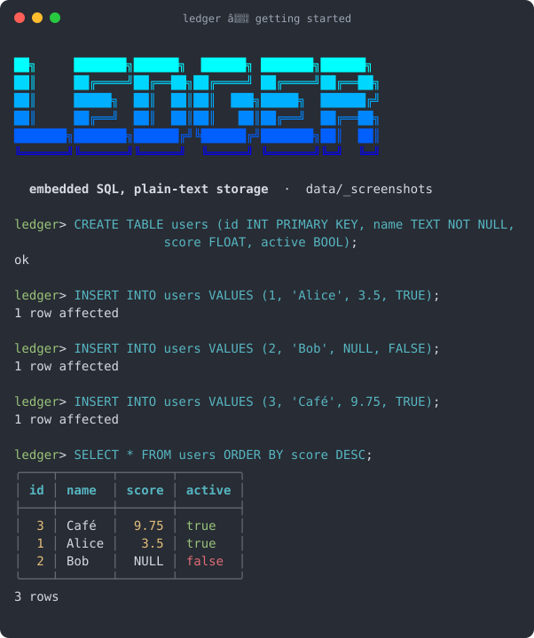
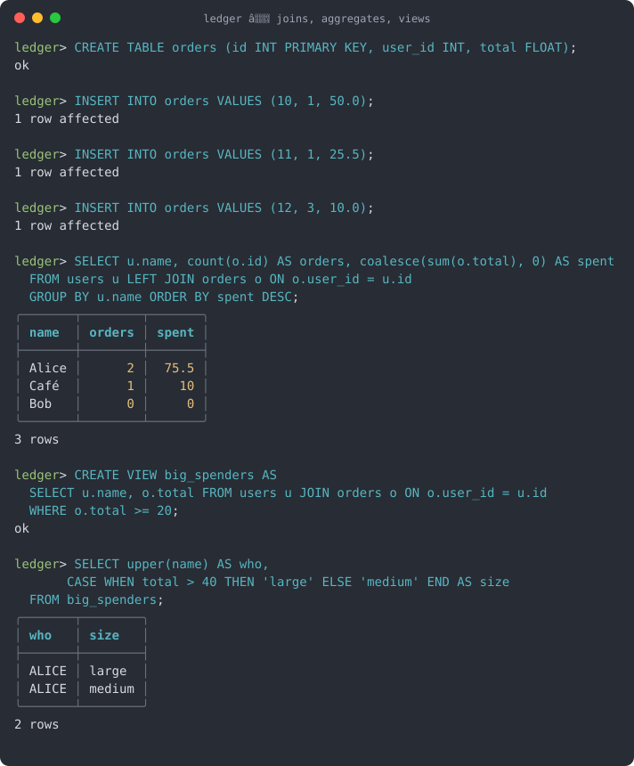
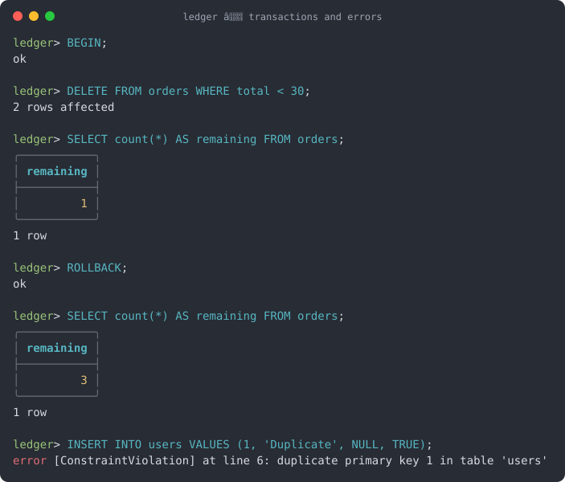

# Ledger

An embedded SQL engine in C++20 with plain-text storage. A learning project,
meant for personal use afterwards.



## Scope (v1)

- `CREATE TABLE` / `DROP TABLE` — types `INT`, `FLOAT`, `TEXT`, `BOOL`;
  constraints `PRIMARY KEY` (one per table, implies `NOT NULL`) and `NOT NULL`.
- `INSERT INTO t [(cols)] VALUES (...)` — one row per statement.
- `SELECT * | t.* | expr [AS alias], ... FROM t [AS a] [[INNER|LEFT] JOIN u [AS b] ON expr ...]
  [WHERE expr] [GROUP BY expr, ...] [HAVING expr] [ORDER BY expr [ASC|DESC], ...]
  [LIMIT n]`. Columns may be qualified (`a.col`); unqualified names must be
  unambiguous. Views can contain joins and take part in joins.
- Aggregates `COUNT(*)`, `COUNT(x)`, `SUM`, `AVG`, `MIN`, `MAX` (NULLs skipped;
  SUM over INT stays INT and refuses to overflow).
- `UPDATE t SET col = expr, ... [WHERE expr]`, `DELETE FROM t [WHERE expr]`.
- `CREATE VIEW v AS SELECT cols FROM t [WHERE expr]` / `DROP VIEW v` — a view is
  a stored projection + filter over a table or another view; it can be
  queried like a table (with its own WHERE / ORDER BY / LIMIT) and is
  read-only. `ORDER BY` and `LIMIT` are not allowed inside a view definition.
  Dropping a table or view that another view reads from is refused.
- `SELECT DISTINCT ...`, `LIMIT n OFFSET m`.
- Scalar functions `UPPER`, `LOWER`, `LENGTH`, `TRIM`, `ABS`, `ROUND(x [, digits])`,
  `COALESCE(...)`, `NULLIF(a, b)`; `CASE [x] WHEN ... THEN ... [ELSE ...] END`.
- Uncorrelated subqueries: `x [NOT] IN (SELECT ...)`, `[NOT] EXISTS (SELECT ...)`,
  scalar `(SELECT ...)` (one column, at most one row). `UNION` / `UNION ALL`
  with a final `ORDER BY` on output column names.
- Expressions: `+ - * /`, comparisons, `AND OR NOT`, `IS [NOT] NULL`,
  `[NOT] IN (...)`, `[NOT] BETWEEN a AND b`, `[NOT] LIKE 'pattern'` (`%`, `_`),
  SQL three-valued logic. Case-insensitive identifiers.
- `BEGIN [TRANSACTION]` / `COMMIT` / `ROLLBACK`: writes are applied at once and
  logged; `ROLLBACK` undoes them in reverse order. Atomic within the process,
  not across a crash. `CREATE` / `DROP` are refused inside a transaction; a
  session closing mid-transaction rolls it back.
- Every `PRIMARY KEY` has an in-memory index (rebuilt when a table is loaded):
  key uniqueness and `WHERE pk = value` on a table are answered without a
  scan. No user-defined indexes.
- No correlated subqueries.





The images above are generated from the real program output by
`tools/screenshots.sh` (`tools/ansi2svg.pl` turns the coloured terminal
output into SVG), so they always match the current build.

## Build and test

Toolchain: GCC ≥ 13 (or Clang), CMake ≥ 3.20, Ninja. On Windows, MSYS2 UCRT64.

```sh
cmake -S . -B build -G Ninja
cmake --build build
./build/ledger_tests          # doctest suite
```

With UBSan (no runtime dependency, also works with MinGW GCC):

```sh
cmake -S . -B build-san -G Ninja \
  -DCMAKE_CXX_FLAGS="-fsanitize=undefined -fsanitize-undefined-trap-on-error"
cmake --build build-san && ./build-san/ledger_tests
```

## Usage

```sh
./build/ledger mydb              # REPL: statements end with ';', .help for commands
./build/ledger mydb < script.sql # script mode: stops at the first error
```

A bare name like `mydb` is stored under the data root: `data/mydb` next to
the project (the parent of the `build/` directory holding the executable),
whatever the current directory, or `$LEDGER_DATA_DIR/mydb` if that variable is
set. The `data/` directory is ignored by git, so every database stays out of
the repository. An argument containing a path separator (`./mydb`,
`C:\dbs\mydb`) is used as is.

```
ledger> CREATE TABLE users (id INT PRIMARY KEY, name TEXT NOT NULL, score FLOAT);
ok
ledger> INSERT INTO users VALUES (1, 'Alice', 3.5);
1 row affected
ledger> SELECT * FROM users WHERE score > 1 ORDER BY name;
+----+-------+-------+
| id | name  | score |
+----+-------+-------+
| 1  | Alice | 3.5   |
+----+-------+-------+
1 row
```

In a terminal, results are drawn with rounded Unicode borders and colours
(bold headers, right-aligned numbers, dim `NULL`, green/red booleans):

```
╭────┬───────┬───────╮
│ id │ name  │ score │
├────┼───────┼───────┤
│  1 │ Alice │   3.5 │
│  2 │ Bob   │  NULL │
╰────┴───────┴───────╯
2 rows
```

When stdout is a pipe or a file the output is plain ASCII without escape
sequences (the `+---+` tables shown above). `NO_COLOR=1` forces plain output;
`LEDGER_STYLE=fancy` or `LEDGER_STYLE=plain` forces one style either way.

Exit codes: `0` ok, `1` SQL or database error, `2` usage error.

## On-disk format

One directory per database, one sub-directory per table:

```
data/mydb/
  LOCK                 present while a process has the database open
  views.txt            ledger-views 1   then  <view>\t<escaped SELECT>, one per line
  users/
    schema.txt         ledger-schema 1  then  <column> <TYPE> [PK|NN]
    rows.txt           ledger-rows 1    then  I <rowid>\t<fields>  or  D <rowid>
```

`rows.txt` is append-only: an `UPDATE` writes a `D` tombstone followed by a new
version with the same rowid; the file is compacted automatically when
tombstones dominate. Fields are tab-separated, `NULL` is encoded as `\N`, text
is escaped (`\\ \t \n \r`).

## Architecture

Strict layers, downward dependencies only:

```
sql (lexer, parser, ast)  →  semantic (catalog, binder, eval)  →  exec  →  cli
                                                 ↘  storage (IStorageEngine: FileEngine, MemoryEngine)
core: Result<T> (no exceptions), Value, Row, TableSchema
```
